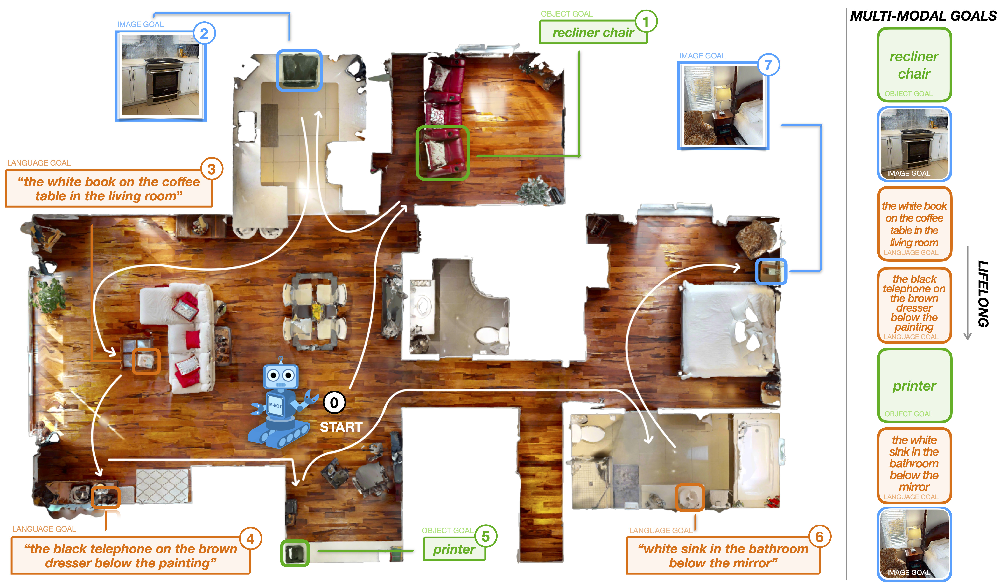

# GOAT-Bench: A Benchmark for Multi-Modal Lifelong Navigation

Code for our paper [GOAT-Bench: A Benchmark for Multi-Modal Lifelong Navigation](as). 

Mukul Khanna*, Ram Ramrakhya*, Gunjan Chhablani, Sriram Yenamandra, Theophile Gervet, Matthew Chang, Zsolt Kira, Devendra Singh Chaplot, Dhruv Batra, Roozbeh Mottaghi

<p align="center">
    <a href="https://mukulkhanna.github.io/goat-bench/">Project Page</a>
</p>

## :robot: GOAT-Bench

<p align="center">
  
  <p align="center">Sample episode from GOAT-Bench</p>  
</p>


GOAT-Bench is a benchmark for the Go to Any Thing (GOAT) task where an agent is spawned randomly in an unseen indoor environment and tasked with sequentially navigating to a variable number (in 5-10) of goal objects, described via the category name of the object (e.g. `couch`), a language description (e.g. `a black leather couch next to coffee table`), or an image of the object uniquely identifying the goal instance in the environment. We refer to finding each goal in a GOAT episode as a subtask. Each GOAT episode comprises 5 to 10 subtasks. We set up the GOAT task in an open-vocabulary setting; unlike many prior works, we are not restricted to navigating to a predetermined, closed set of object categories. The agent is expected to reach the goal object $g^k$ for the $k^{th}$ subtask as efficiently as possible within an allocated time budget. Once the agent completes the $k^{th}$ subtask by reaching the goal object or exhausts the allocated time budget, the agent receives next goal $g^{k+1}$ to navigate to. We use HelloRobot's Stretch robot embodiment for the GOAt agent. The agent has a height of 1.41m and base radius of 17cm. At each timestep, the agent has access to an 360 x 640 resolution RGB image $I_t$, depth image $D_t$, relative pose sensor with GPS+Compass information $P_t = (\delta x, \delta y, \delta z)$ from onboard sensors, as well as the current subtask goal $g^{k}_t$, $k$  $\forall$ $\{1, 2,...,5-10\}$. The agent's action space comprises move forward (by 0.25m), turn left and right (by 30º), look up and down (by 30º), and stop actions. A sub-task in a GOAT episode is deemed successful when the agent calls stop action within 1 meter euclidean distance from the current goal object instance – within a budget of 500 agent actions (per sub task).


## :hammer: Installation

Create the conda environment and install all of the dependencies. Mamba is recommended for faster installation:
```bash
# Create conda environment. Mamba is recommended for faster installation.
conda_env_name=goat
mamba create -n $conda_env_name python=3.7 cmake=3.14.0 -y
mamba install -n $conda_env_name \
  habitat-sim=0.2.3 headless pytorch cudatoolkit=11.3 \
  -c pytorch -c nvidia -c conda-forge -c aihabitat -y

# Install this repo as a package
mamba activate $conda_env_name
pip install -e .

# Install habitat-lab
git clone --branch v0.2.3 git@github.com:facebookresearch/habitat-lab.git
cd habitat-lab
pip install -e habitat-lab
pip install -e habitat-baselines

pip install -r requirements.txt
pip install git+https://github.com/openai/CLIP.git
pip install ftfy regex tqdm GPUtil trimesh seaborn timm scikit-learn einops transformers

git clone  https://github.com/facebookresearch/eai-vc.git
cd eai-vc

pip install -e vc_models/
```


## :floppy_disk: Dataset

- Download the HM3D dataset using the instructions [here](https://github.com/facebookresearch/habitat-sim/blob/main/DATASETS.md#habitat-matterport-3d-research-dataset-hm3d) (download the full HM3D dataset for use with habitat)

- Move the HM3D scene dataset or create a symlink at `data/scene_datasets/hm3d`.

- Download the GOAT-Bench episode dataset from [here](https://drive.google.com/file/d/1N0UbpXK3v7oTphC4LoDqlNeMHbrwkbPe/view?usp=sharing).

### Dataset Folder Structure

The code requires the datasets in `data` folder in the following format:

  ```bash
  ├── goat-bench/
  │  ├── data
  │  │  ├── scene_datasets/
  │  │  │  ├── hm3d/
  │  │  │  │  ├── train/
  │  │  │  │  │   ├── 00488-F8PSGjTiv61/
  │  │  │  │  │   │   ├── 00488-F8PSGjTiv61.navmesh
  │  │  │  │  │   │   ├── 00488-F8PSGjTiv61.glb
  │  │  ├── datasets
  │  │  │  ├── goat_bench/
  │  │  │  │  ├── hm3d/
  │  │  │  │  |  ├── v1/
  │  │  │  │  │  │  ├── train/
  │  │  │  │  │  │  ├── val_seen/
  │  │  │  │  │  │  ├── val_seen_synonyms/
  │  │  │  │  │  │  ├── val_unseen/
  ```

### Cached Embeddings and Model Checkpoints

In order to increase training throughput we leverage frozen pretrained visual and text encoder (ex: CLIP) for encoding goals. As the goal encoders are not being finetuned during training we cache the embeddings for all object categories, language instructions and image goals on disk. You can download these embeddings from the following [huggingface repo 🤗](https://huggingface.co/datasets/axel81/goat-bench) using following command:

```bash
git clone https://huggingface.co/datasets/axel81/goat-bench data/goat-assets/
```

This command will download cached embeddings and model checkpoints for SenseAct-NN monolithic policy.

## :bar_chart: Training


### SenseAct-NN Monolithic Baseline

Run the following command to train the monolithic GOAT policy that uses goal embeddings generated using CLIP text and image encoder:

```bash
TENSORBOARD_DIR="/path/to/tensorboard/dir/"
CHECKPOINT_DIR="/path/to/checkpoint/dir/"

python -um goat_bench.run   --run-type train \
  --exp-config config/experiments/ver_goat_monolithic.yaml \
  habitat_baselines.num_environments=4 \
  habitat_baselines.tensorboard_dir=${TENSORBOARD_DIR} \
  habitat_baselines.checkpoint_folder=${CHECKPOINT_DIR}
```

To run distributed training on more than 1 GPU on a compute cluster managed using slurm use the following sbatch script:

```bash
sbatch scripts/train/2-goat-ver-monolithic.sh
```


## 🎯 Evaluation

### SenseAct-NN Monolithic Baseline

Run the following command to evaluate the SenseAct-NN monolithic policy on the `val_seen` evaluation split:

```bash
DATA_PATH="data/datasets/goat_bench/hm3d/v1/"
eval_ckpt_path_dir="/path/to/goat-assets/checkpoints/sense_act_nn_monolithic/"
tensorboard_dir="/path/to/tensorboard/"
split="val_seen"

python -um goat_bench.run   --run-type eval \
  --exp-config config/experiments/ver_goat_monolithic.yaml   \
  habitat_baselines.num_environments=1   \
  habitat_baselines.trainer_name="goat_ppo"   \
  habitat_baselines.tensorboard_dir=$tensorboard_dir   \
  habitat_baselines.eval_ckpt_path_dir=$eval_ckpt_path_dir   \
  habitat.dataset.data_path="${DATA_PATH}/${split}/${split}.json.gz"   \
  habitat_baselines.load_resume_state_config=False   \
  habitat_baselines.eval.use_ckpt_config=False   \
  habitat_baselines.eval.split=$split  \
  habitat.task.lab_sensors.goat_goal_sensor.image_cache=/path/to/image_goal_embeddings/${split}_embeddings/ \
  habitat.task.lab_sensors.goat_goal_sensor.language_cache=/path/to/language_goal_embeddings/${split}_instruction_clip_embeddings.pkl 
```

Similarly you can evaluate the same checkpoint on `val_seen_synonyms` and `val_unseen` splits by changing the value of environment variable `split` in the above command.

To run evaluation on slurm as batch job use the following sbatch script:

```bash
sbatch scripts/eval/2-goat-eval.sh
```


### SenseAct-NN Skill-Chain Baseline

Run the following command to evaluate the SenseAct-NN skill chain policy that chains individual policies trained for each modality:

```bash
tensorboard_dir="/path/to/tensorboard/dir/"
eval_ckpt_path_dir="/path/to/goat-assets/checkpoints/sense_act_nn_skill_chain/"

python -um goat_bench.run \
  --run-type eval \
  --exp-config config/experiments/ver_goat_skill_chain.yaml \
  habitat_baselines.num_environments=1 \
  habitat_baselines.trainer_name="goat_ppo" \
  habitat_baselines.rl.policy.name=GoatHighLevelPolicy \
  habitat_baselines.tensorboard_dir=$tensorboard_dir \
  habitat_baselines.eval_ckpt_path_dir=$eval_ckpt_path_dir \
  habitat_baselines.checkpoint_folder=$eval_ckpt_path_dir \
  habitat.dataset.data_path="${DATA_PATH}/${split}/${split}.json.gz" \
  +habitat/task/lab_sensors@habitat.task.lab_sensors.clip_objectgoal_sensor=clip_objectgoal_sensor \
  +habitat/task/lab_sensors@habitat.task.lab_sensors.language_goal_sensor=language_goal_sensor \
  +habitat/task/lab_sensors@habitat.task.lab_sensors.cache_instance_imagegoal_sensor=cache_instance_imagegoal_sensor \
  ~habitat.task.lab_sensors.goat_goal_sensor \
  habitat.task.lab_sensors.cache_instance_imagegoal_sensor.cache=data/goat-assets/goal_cache/iin/${split}_embeddings/ \
  habitat.task.lab_sensors.language_goal_sensor.cache=data/goat-assets/goal_cache/language_nav/${split}_bert_embedding.pkl \
  habitat_baselines.load_resume_state_config=False \
  habitat_baselines.eval.use_ckpt_config=False \
  habitat_baselines.eval.split=$split \
  habitat_baselines.eval.should_load_ckpt=False \
  habitat_baselines.should_load_agent_state=False
```

## :pencil: Citation

If you use this code or benchmark in your research, please consider citing:

```
@inproceedings{khanna2024goatbench,
      title={GOAT-Bench: A Benchmark for Multi-Modal Lifelong Navigation}, 
      author={Mukul Khanna* and Ram Ramrakhya* and Gunjan Chhablani and Sriram Yenamandra and Theophile Gervet and Matthew Chang and Zsolt Kira and Devendra Singh Chaplot and Dhruv Batra and Roozbeh Mottaghi},
      year={2024},
      booktitle={CVPR},
}
```
